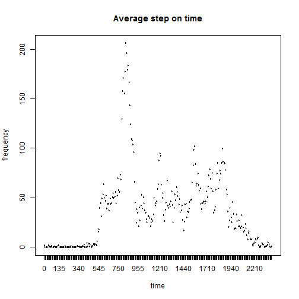
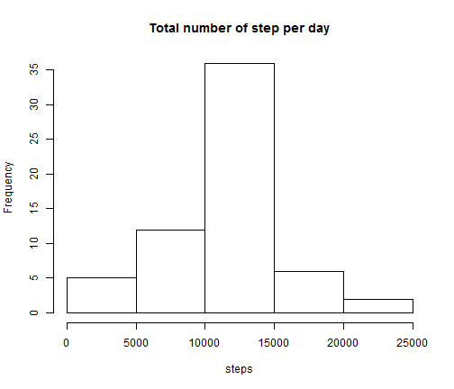
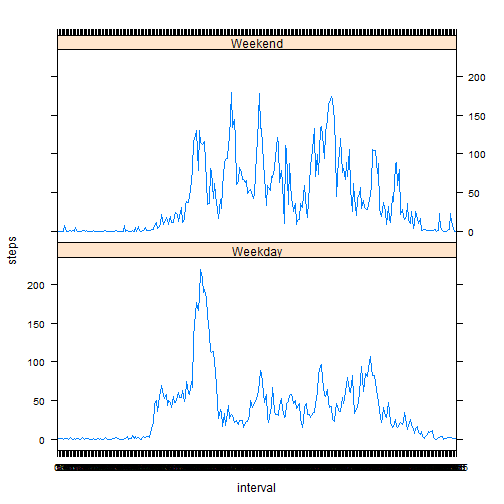

REP DATA PEER ASSIGNMENT 1
========================================================

## Step 1: Loading and preprocessing the data

read in the data and set the 'Date' 

```r
data <- read.csv("activity.csv", header = T)
```

```
## Warning: cannot open file 'activity.csv': No such file or directory
```

```
## Error: cannot open the connection
```


## Step 2: What is mean total number of steps taken per day?


Make calculation of step set each day - and create array with the total step for each day


```r
steponeday <- tapply(data$steps, data$date, sum, na.rm = TRUE)
```


Make a histogram of the total number of steps taken each day


```r
hist(steponeday, main = "Total number of step per day", xlab = "steps")
```

 


### Calculate and report the mean and median total number of steps taken per day

First we reshape the data_set to be able to preform these calculations

```r
library(reshape2)
set_steponeday <- melt(data, id = "date", measure.vars = "steps")
steponeday <- dcast(set_steponeday, date ~ variable, sum, na.rm = TRUE)
```


The mean of the number of steps per day


```r
mean(steponeday[, 2])
```

```
## [1] 10766
```


The median of the number of steps per day


```r
median(steponeday[, 2])
```

```
## [1] 10766
```


## step 3: What is the average daily activity pattern?

Make a time series plot (i.e. type = "l") of the 5-minute interval (x-axis) and the average number of steps taken, averaged across all days (y-axis)


```r
data$interval <- as.factor(data$interval)

steponinterval_set <- melt(data, id = "interval", measure.vars = "steps")
steponinterval <- dcast(steponinterval_set, interval ~ variable, mean, na.rm = TRUE)
plot(steponinterval$interval, steponinterval$steps, type = "l", main = "Average step on time", 
    xlab = "time", ylab = "frequency")
```

 


Which 5-minute interval, on average across all the days in the dataset, contains the maximum number of steps?


```r
max(steponinterval$steps)
```

```
## [1] 206.2
```

```r
subset(steponinterval, steponinterval$steps == max(steponinterval$steps))
```

```
##     interval steps
## 104      835 206.2
```

We can see on 835h on average the most steps are made

## Step 4: Imputing missing values


Calculate and report the total number of missing values in the dataset (i.e. the total number of rows with NAs)


```r
number.na <- is.na(data$steps)
table(number.na)
```

```
## number.na
## FALSE 
## 17568
```

We find the total number of missing values is 2304

### Filling in missing Value in data set, using interval averages


By using for-loop to go to data set we update 'data' on missing values


```r
for (i in 1:nrow(data)) {
    if (is.na(data$steps[i])) {
        time <- data$interval[i]
        data$steps[i] <- subset(steponinterval$steps, steponinterval$interval == 
            time)
    }
}
```


We do another check on the missing values and find there are no missing values

```r
number.na <- is.na(data$steps)
table(number.na)
```

```
## number.na
## FALSE 
## 17568
```


Make calculation of step set each day - and create array with the total step for each day


```r
steponeday <- tapply(data$steps, data$date, sum, na.rm = TRUE)
```


Make a histogram of the total number of steps taken each day


```r
hist(steponeday, main = "Total number of step per day", xlab = "steps")
```

 


Calculate and report the mean and median total number of steps taken per day

First we reshape the data_set to be able to preform these calculations

```r
library(reshape2)
set_steponeday <- melt(data, id = "date", measure.vars = "steps")
steponeday <- dcast(set_steponeday, date ~ variable, sum, na.rm = TRUE)
```


The mean of the number of steps per day


```r
mean(steponeday[, 2])
```

```
## [1] 10766
```


The median of the number of steps per day


```r
median(steponeday[, 2])
```

```
## [1] 10766
```


### Conclusion

After filling the missing values the 'total' number of steps per day increased for all days. Just like the 'mean' and 'median' value.

## Step 5: difference in Weekdays and Weekend activities

First we set the date-variable as class(date) in the stepsonintval set
and we use weekdays-function to see the see which day it is.


```r
data$date <- as.Date(data$date)
day <- weekdays(data$date)
```


Function to set day name to Weekend and Weekday and add to data_set


```r
for (i in 1:length(day)) {
    if (day[i] == "Saterday") {
        day[i] <- "Weekend"
    } else if (day[i] == "Sunday") {
        day[i] <- "Weekend"
    } else {
        day[i] <- "Weekday"
    }
}

data[, 4] <- day
names(data)[4] <- "day"
```


Divide data in two sets"weekend" and "weekday"
Reshape new dataset for steponinterval for both sets


```r
weekday_set <- subset(data, data$day == "Weekday")
weekend_set <- subset(data, data$day == "Weekend")
steponinterval_set_wd <- melt(weekday_set, id = "interval", measure.vars = "steps")
steponinterval_wd <- dcast(steponinterval_set_wd, interval ~ variable, mean)
steponinterval_wd[, 3] <- "Weekday"
names(steponinterval_wd)[3] <- "day"

steponinterval_set_we <- melt(weekend_set, id = "interval", measure.vars = "steps")
steponinterval_we <- dcast(steponinterval_set_we, interval ~ variable, mean)
steponinterval_we[, 3] <- "Weekend"
names(steponinterval_we)[3] <- "day"

new_set <- rbind(steponinterval_we, steponinterval_wd)
```


plot the data

```r
library(lattice)
xyplot(steps ~ interval | day, data = new_set, type = "l", layout = c(1, 2))
```

 

